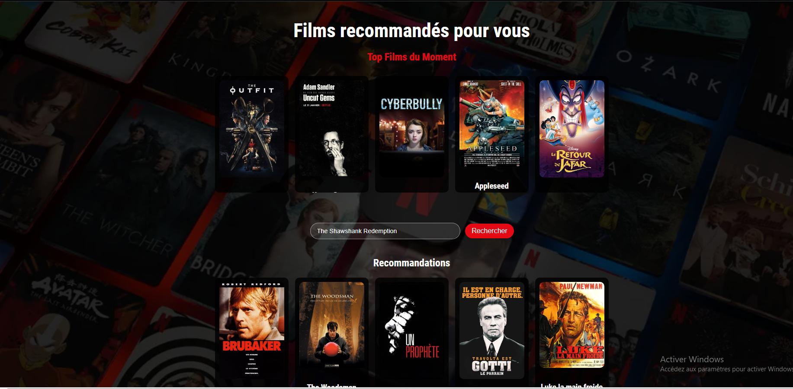

# Netflix Recommendation System



 **Netflix Recommendation System** est une application web qui génère des recommandations de films basées sur un système de filtrage collaboratif. L'application utilise **Flask** pour le backend et **React** pour le frontend, et les recommandations sont basées sur des algorithmes de similarité de films utilisant **TF-IDF** et **cosine similarity**.

## Fonctionnalités principales

- **Page d'accueil** : Affichage de 5 films aléatoires.
- **Recommandations personnalisées** : L'utilisateur peut rechercher un film, et le système propose des films similaires.
- **API Backend** : Le backend expose des endpoints pour obtenir des films aléatoires, des titres de films, et des recommandations basées sur un titre de film.
  
## Architecture du projet

### Backend
- **Flask** : Framework Python pour gérer l'API RESTful.
- **Flask-CORS** : Permet la communication entre le frontend et le backend en autorisant les requêtes cross-origin.
- **Pandas et Numpy** : Utilisés pour manipuler et traiter les données des films et les matrices de similarité.
- **Scikit-learn** : Utilisé pour créer la matrice de similarité en utilisant **TF-IDF** et **cosine similarity**.
- **Requests** : Utilisé pour interagir avec l'API **TMDb** pour récupérer des informations sur les films.

### Frontend
- **React** : Librairie JavaScript pour la construction de l'interface utilisateur.
- **Nginx** : Utilisé pour servir les fichiers statiques du frontend dans un environnement de production.

### Docker
- **Docker Compose** : Utilisé pour orchestrer le démarrage des services (frontend, backend, nginx) dans des conteneurs Docker.

## Installation

### Prérequis

Avant de commencer, assurez-vous d'avoir les outils suivants installés :
- **Docker** et **Docker Compose** : Pour exécuter l'application dans des conteneurs Docker.
- **Node.js** et **npm** : Pour exécuter le frontend React en mode développement.
- **Python 3.9+** : Pour exécuter le backend avec Flask.
- **pandas**, **numpy**, **scikit-learn**, **requests**, **flask**, **flask_cors** : Dépendances Python utilisées pour le backend.

### Cloner le projet

Clonez ce repository sur votre machine locale :

```bash
git clone https://github.com/gaetanyossa/netflix_recommandation_system.git
cd netflix-recommendation-system
```

### Configurer le Backend

1. **Créer un environnement virtuel** (facultatif, mais recommandé) :
   
   ```bash
   python -m venv venv
   ```

2. **Activer l'environnement virtuel** :
   - Sur macOS/Linux :
     ```bash
     source venv/bin/activate
     ```
   - Sur Windows :
     ```bash
     .\venv\Scripts\activate
     ```

3. **Installer les dépendances backend** :
   
   ```bash
   pip install -r requirements.txt
   ```

4. **Obtenir une clé API de TMDb** : Inscrivez-vous sur [The Movie Database](https://www.themoviedb.org/) et obtenez une clé API. Remplacez la valeur de `API_KEY` dans le fichier `app.py` par votre propre clé.

   ```python
   API_KEY = "ta_cle_api_tmdb"
   ```

### Configurer le Frontend

1. **Naviguer dans le dossier frontend** :
   
   ```bash
   cd frontend
   ```

2. **Installer les dépendances Node.js** :
   
   ```bash
   npm install
   ```

### Exécution du Projet avec Docker

1. **Lancer tous les services avec Docker Compose** :
   
   Dans le répertoire racine du projet, exécutez :

   ```bash
   docker-compose up --build
   ```

Cela va :
- Recréer les images Docker pour le backend, le frontend et Nginx.
- Démarrer les services dans des conteneurs Docker.

### Accès à l'application

- **Frontend** : Une fois les services lancés, vous pouvez accéder à l'interface utilisateur en ouvrant [http://localhost:80](http://localhost:80) dans votre navigateur.
- **Backend API** : L'API backend sera accessible à [http://localhost:5000](http://localhost:5000).

## Structure du projet

Voici un aperçu de la structure du projet :

```
NETFLIX_RECOMMENDATION_SYSTEM/
├── .gitignore                  # Fichier pour ignorer certains fichiers/dossiers dans Git
├── .dockerignore               # Fichier pour ignorer certains fichiers/dossiers dans Docker
├── frontend/                   # Dossier contenant l'application frontend (React)
│   ├── build/                  # Dossier généré par `npm run build` (fichiers statiques React)
│   ├── node_modules/           # Dépendances du frontend (installées via npm)
│   ├── public/                 # Contient des fichiers publics comme index.html, favicon, etc.
│   ├── src/                    # Code source du frontend (composants React)
│   │   ├── App.js              # Composant principal de l'application React
│   │   ├── index.js            # Point d'entrée de l'application React
│   │   ├── App.css             # CSS global du frontend
│   │   └── ...                 # Autres fichiers de composants et styles
│   ├── Dockerfile              # Dockerfile pour construire l'image du frontend
│   ├── package.json            # Dépendances et scripts pour le frontend
│   ├── package-lock.json       # Verrouillage des versions des dépendances du frontend
│   └── ...                     # Autres fichiers du frontend
├── app.py                      # Fichier principal de l'application backend (Python)
├── requirements.txt            # Fichier des dépendances du backend (Python)
├── generate_files.py           # Script Python pour générer des fichiers nécessaires ( données de similarité et la liste des films)
├── movies_list.pkl             # Liste des films au format pickle
├── Notebook.ipynb              # Notebook Jupyter (pour l'analyse des données)
├── docker-compose.yml          # Fichier de configuration Docker Compose
├── README.md                   # Documentation du projet
└── similarity.pkl              # Fichier pickle pour la similarité des films

```

### Fonctionnement du Backend

Le backend expose les endpoints suivants :

- **`GET /random_movies`** : Retourne 5 films aléatoires.
- **`GET /movies_titles`** : Retourne la liste de tous les titres de films.
- **`POST /recommend`** : Retourne des recommandations basées sur le titre d'un film donné. Il utilise la matrice de similarité pour générer ces recommandations.

### Fonctionnement du Frontend

Le frontend permet à l'utilisateur de : Rechercher un film et obtenir des recommandations personnalisées basées sur son titre.

## Améliorations possibles

- Ajouter une fonctionnalité de pagination pour les résultats de recherche.
- Permettre à l'utilisateur de sauvegarder ses films favoris.
- Ajouter des filtres pour affiner les recommandations (par genre, année, etc.).
